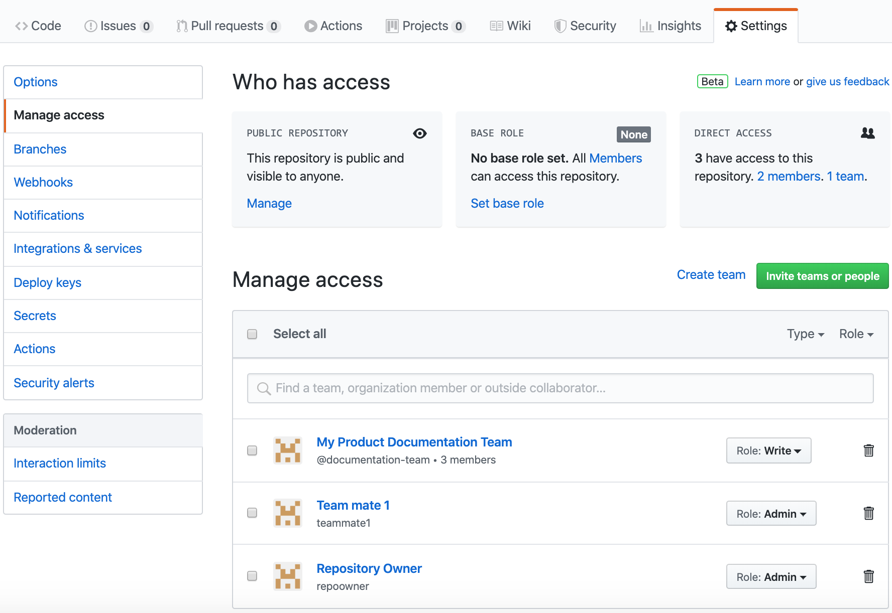

# Accordion Test

## Raw Text

### No Header, No Body

<details>
  <summary style="font-size:20px"></summary>

</details>

### Yes Header, No Body

<details>
    <summary>Heading</summary>

</details>

### No Header, Got Body

<details>
    <summary></summary>

<small>
Lorem ipsum dolor sit amet, consectetur adipiscing elit, sed do eiusmod tempor incididunt ut labore et dolore magna aliqua. Amet risus nullam eget felis. Eros in cursus turpis massa tincidunt dui ut. Eget nulla facilisi etiam dignissim diam quis. Magna etiam tempor orci eu lobortis elementum nibh tellus molestie. Varius duis at consectetur lorem donec massa. Bibendum neque egestas congue quisque. Egestas egestas fringilla phasellus faucibus. Quis viverra nibh cras pulvinar mattis nunc. A lacus vestibulum sed arcu non. Feugiat sed lectus vestibulum mattis. Quis viverra nibh cras pulvinar. Eget sit amet tellus cras adipiscing enim eu turpis egestas. Purus non enim praesent elementum. Porta lorem mollis aliquam ut porttitor leo a. Convallis aenean et tortor at. Aenean et tortor at risus viverra adipiscing at in.
</small>
</details>

### Got Header, Got Body And Comments 😺

<details>
    <summary><h1>Heading 😺😺😺😺😺</h1></summary>
    <!-- LEAVE A GAP BELOW -->

Lorem ipsum dolor sit amet, consectetur adipiscing elit, sed do eiusmod tempor incididunt ut labore et dolore magna aliqua. Amet risus nullam eget felis. Eros in cursus turpis massa tincidunt dui ut. Eget nulla facilisi etiam dignissim diam quis. Magna etiam tempor orci eu lobortis elementum nibh tellus molestie. Varius duis at consectetur lorem donec massa. Bibendum neque egestas congue quisque. Egestas egestas fringilla phasellus faucibus. Quis viverra nibh cras pulvinar mattis nunc. A lacus vestibulum sed arcu non. Feugiat sed lectus vestibulum mattis. Quis viverra nibh cras pulvinar. Eget sit amet tellus cras adipiscing enim eu turpis egestas. Purus non enim praesent elementum. Porta lorem mollis aliquam ut porttitor leo a. Convallis aenean et tortor at. Aenean et tortor at risus viverra adipiscing at in.

</details>

## Raw Text With Styles

<details>
    <summary><h3 style="color:blue;"><b><i>Big Fancy Body</i></b></h3></summary>

<small>Hello world</small>
<h1>Bye World</h1>

</details>

<details>
    <summary><h1 style="color:red;"><b><i>Big Fancy Title With Image</i></b></h1></summary>

Github Repo


</details>

## Integration with different plugin

<details>
    <summary><h1 style="color:red;"><b><i>Very Fancy TItle</i></b></h1></summary>

## Docsify Markdown Extensions

?> Docsify provides [some useful extensions to markdown](https://docsify.js.org/#/helpers). Some examples are shown below.

### Content highlighting

Use `?>` and `!>` before text to highlight blocks of content:

```markdown
?> This is highlighted

!> And so am I
```

?> This is highlighted

!> And so am I

### Image resizing

```


```


### Set target attribute for link

```
[link](/example ':target=_blank')
[link](/example2 ':target=_self')
```

[link](/example ":target=_blank")
[link](/example2 ":target=_self")

### Disabled Link

```
[link](/demo ':disabled')
```

[link](/demo ":disabled")

## HTML

Some useful HTML elements are available for adding default interactivity and illustrations.

### Nested Details/summary for dropdown content


<details>
<summary>Click me to expand!</summary>

I can contain markdown content too. Just leave a newline between markdown and HTML elements.

- Abc
- Def

</details>


### Progress/meter bars

```html
<progress value="70" max="100"></progress>

<meter
  min="0" max="100"
  low="33" high="66" optimum="80"
  value="50">
Current value: 50/100
</meter>
```

<progress value="70" max="100"></progress>

<meter
  min="0" max="100"
  low="33" high="66" optimum="80"
  value="50">
Current value: 50/100
</meter>

</details>

## XSS Attempts

### <script>alert(123)</script>
### "><script>alert(document.cookie)</script>
<!-- ### <script>alert(1)</script> -->
<!-- ###  -->

<details>
    <summary>"><script>alert(document.cookie)</script></summary>

"><script>alert(document.cookie)</script>

Github Repo


</details>
